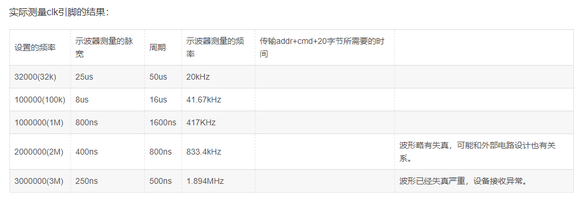

# SSD1306_RaspberryPi
树莓派驱动SSD1306_oled屏幕播放视频

想用oled播放视频，找到了[luma.examples](https://github.com/rm-hull/luma.examples)有一个写好的直接播放视频的程序，但是这个库这么都装不上，无奈想想办法自己写了一个。

介于python性能问题（I2C协议也有一定影响），播放帧数较慢

## 安装

本项目用到了Adafruit Python SSD1306，PyAV等库

可以通过I2C和SPI接口连接，需要切换屏幕分辨率和协议请参看注释修改程序

```bash
sudo apt-get install build-essential python-dev python-pip python-imaging python-smbus pygame git -y
sudo pip install RPi.GPIO

git clone https://github.com/adafruit/Adafruit_Python_SSD1306.git
cd Adafruit_Python_SSD1306
sudo python setup.py install

sudo apt install -y libavformat-dev libavcodec-dev libavdevice-dev libavutil-dev libswscale-dev libavresample-dev libavfilter-dev -y
sudo pip install av
```

## 启动

```bash
git clone https://github.com/Jackadminx/SSD1306_RaspberryPi.git && cd SSD1306_RaspberryPi
python image.py  ## 播放image文件夹内顺序图片帧
python video.py  ## 播放12864.mp4
```

如需载入其他视频请更改代码

暂不支持直接播放视频中的音频，请将其分离为MP3文件


默认视频参数：12864.mp4 128*64 24帧，无音频 


## 更新

### 提高I2C总线传输速度

```bash
sudo vim /boot/config.txt
```
添加代码，i2c_arm_baudrate后面跟i2c频率

```
dtparam=i2c_arm=on,i2c_arm_baudrate=1000000
```



